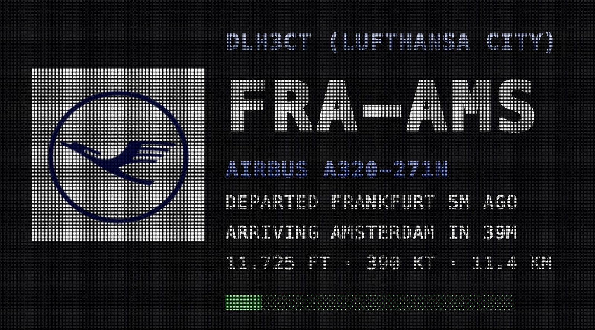
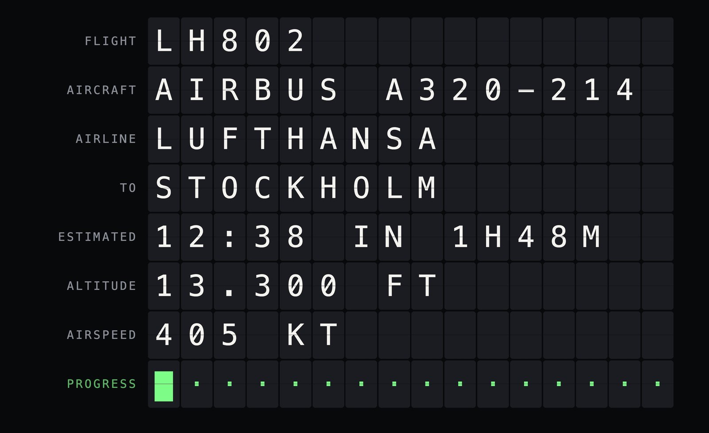

# Flight Wall

A flight display for Home Assistant. When an aircraft passes overhead, a
full-screen board shows the airline, callsign, route, aircraft type,
arrival estimate, live telemetry, and a progress bar.

Use it on a television (Chromecast) or a wall-mounted tablet. Inspired
by physical LED flight boards, in particular
[The Flightwall](https://theflightwall.com/).



## What it does

- Picks the single most visible aircraft in range using **elevation
  angle**, not ground distance. A jet at 38,000 ft ten kilometres away
  is not the plane in the window; the one on approach at 3,000 ft is.
- Shows city names, registration, heading, and a next-up flight when a
  second aircraft is in range. Empty sky shows a clock and the last
  aircraft overhead.
- On a TV, writes a 4K board image and Casts it. On a tablet, a
  full-screen popup can use the LED look or an animated split-flap
  board.

## Themes

The HACS integration (TV path) has four themes under
**Settings → Devices & Services → Flight Wall → Configure**:

| Theme | Look |
|---|---|
| **LED night** | Black board, blue muted text, green progress, LED grid |
| **Plain large type** | Same colours, no grid — clearest on a large set |
| **Amber departures** | Warm amber type on black |
| **Split-flap** | Mechanical departure board (labels + 16-character flaps). Still image on TV; the tablet HTML page animates |

Airline marks sit in a logo column. When Flightradar24 has no airline
code, a generic aircraft mark is used so the layout stays the same.
Split-flap has no logo — a real flap board cannot display one.

The older tablet popup still switches with `input_select.flightwall_style`
(`dot-matrix` or `split-flap`).



## Requirements

### Television (HACS)

| Component | Source | Why |
|---|---|---|
| [Flightradar24](https://github.com/AlexandrErohin/home-assistant-flightradar24) | HACS | Flight data |
| A `media_player` that reports TV on/off | Core (Vizio, webOS, Android TV, …) | Knows the set is on |
| A Google Cast `media_player` on that set | Core | Receives the board image |

Home Assistant should be reachable over **HTTPS** (Nabu Casa or
`external_url`) so Cast can discover it. The board image is served on
the LAN as `/local/flightwall-board.png`.

Do **not** also install `packages/flightwall.yaml` if you use HACS —
you would get duplicate entities.

### Tablet popup (optional package)

| Component | Source | Why |
|---|---|---|
| [browser-mod](https://github.com/thomasloven/hass-browser_mod) | HACS | Full-screen popup |
| [card-mod](https://github.com/thomasloven/lovelace-card-mod) | HACS | Styling |
| [stack-in-card](https://github.com/custom-cards/stack-in-card) | HACS | Popup can only hold one card |

Optional: [Fully Kiosk Browser](https://www.fully-kiosk.com/) with the
Plus licence if Home Assistant should wake the tablet.

### Data source

The Flightradar24 integration uses an undocumented endpoint. It can
break when FR24 changes their API. For something durable, run a local
ADS-B receiver (RTL-SDR plus `readsb`/`tar1090`) and point the flights
sensor at that instead.

## Installation

### HACS (recommended)

1. Install [Flightradar24](https://github.com/AlexandrErohin/home-assistant-flightradar24)
   via HACS. Set coordinates and a **30 km** radius. Rename the
   flights-in-area sensor to `sensor.flightradar24_flights_in_area` if
   you want the default name (the integration names it after your HA
   language).
2. HACS → three dots → **Custom repositories** →
   `https://github.com/gmisner/ha-flightwall` → type **Integration** →
   Add.
3. Find **Flight Wall** in HACS and download it. Restart Home Assistant.
4. **Settings → Devices & Services → Add integration → Flight Wall.**
   Pick the FR24 flights sensor. For a TV, also pick the power
   `media_player` and the Chromecast `media_player` on that set.
5. Leave `switch.flightwall_tv` on. Put it on a dashboard if someone
   will want Netflix or another app in that room. While the switch is
   on, turning the TV on with the remote starts Cast. If they then
   switch to another source, Flight Wall stays out of the way until the
   set is turned off and on, you re-arm the switch, or you call
   `flightwall.recast`. Keepalive only refreshes while Cast is showing
   the board.
6. **Display**, **Theme**, and **Units** are under
   **Settings → Devices & Services → Flight Wall → Configure**.

The integration creates `sensor.flightwall_flight`, the inbound binary
sensor, the TV switch, and a **Flightwall** sidebar dashboard. The board
should appear about ten seconds after the TV is turned on. Home
Assistant never powers the set down.

**Display**

- **Image** — 4K PNG over Cast. Use this on a television whose built-in
  Chromecast cannot load a live Home Assistant dashboard (many 2018–2020
  smart TVs).
- **Live** — Home Assistant Cast of the Flightwall dashboard. Use this
  on a tablet, Fully Kiosk, or a Chromecast with Google TV. If live
  Cast does not connect, Flight Wall falls back to the image.

**Units:** Imperial (ft, kt, mi) or Metric (m, km/h, km).

Full TV notes: [docs/TV.md](docs/TV.md).

### Tablet popup (manual package)

Use this only if you want the browser-mod LED / animated split-flap
popup. Skip it if you installed from HACS and only want the TV.

#### 1. Flightradar24

Install via HACS, set coordinates, start with a **30 km** radius, and
rename the flights-in-area entity to
`sensor.flightradar24_flights_in_area`.

#### 2. Package

```yaml
homeassistant:
  packages: !include_dir_named packages
```

Copy `packages/flightwall.yaml` into `<config>/packages/`, edit the
`rest_command` with the tablet IP and Fully password (or delete that
block), then restart.

#### 3. Split-flap page

Copy `www/splitflap.html` to
`<config>/www/flightwall/splitflap.html` and restart. Preview:

```
http://your-ha:8123/local/flightwall/splitflap.html
```

#### 4. Check data

**Developer Tools → States → `sensor.flightwall_flight`**. If it is
`none`, stop and see [docs/TROUBLESHOOTING.md](docs/TROUBLESHOOTING.md).

#### 5. Popup automation

**Settings → Automations → Create automation → Edit in YAML**, paste
`automations/flightwall_popup.yaml`. No leading `- `, no `automation:`
key. The popup shows each new aircraft once and closes after the
timeout, on tap, or when the zone is empty.

#### 6. Optional TV without HACS

See [docs/TV.md](docs/TV.md). Prefer the HACS integration instead.

## Configuration

HACS options live in the integration Configure dialog. Tablet popup
behaviour is documented in [docs/CUSTOMISATION.md](docs/CUSTOMISATION.md).

| What | Where | Default |
|---|---|---|
| Display, theme, units | Integration → Configure | Image, LED night, imperial |
| TV is a flight board | `switch.flightwall_tv` (HACS) or `input_boolean.flightwall_tv` | on after setup / off until setup |
| Quiet hours (tablet) | `condition: time` in the popup automation | 07:00–22:00 |
| How long the popup stays | `timeout` in the popup automation | 60000 ms |
| How long after the last aircraft | `delay_off` on the inbound binary sensor | 2 minutes |

## Known limitations

- **Airline logos max out at 128 px** (Kiwi CDN). Roundels work; script
  wordmarks stay hard to read under the LED grid.
- **Missing logos** use a generic aircraft mark so the column does not
  collapse.
- **`aircraft_model` is not always populated.** The ICAO type code is
  the fallback.
- **The LED grid softens type on purpose.** Use the plain theme on a
  large television if you want maximum sharpness.
- **Many built-in Chromecasts cannot load a live Home Assistant
  dashboard.** Use Display → Image. AirPlay is manual mirroring from an
  Apple device; Home Assistant cannot start it. See
  [docs/TV.md](docs/TV.md).
- **Split-flap values are 16 characters.** Longer airline or aircraft
  names truncate.

## Trademarks and affiliation

This is an independent hobby project. It is not affiliated with,
endorsed by, sponsored by, or connected to The Flightwall,
Flightradar24, Kiwi.com, or any airline.

All product names, logos, and brands are the property of their
respective owners. Airline logos are fetched at display time from a
third-party CDN and shown solely to identify the aircraft currently
overhead.

## Credits

Inspired by [The Flightwall](https://theflightwall.com/). Flight data
via the
[Flightradar24 integration](https://github.com/AlexandrErohin/home-assistant-flightradar24)
by AlexandrErohin. Airline logos from the Kiwi.com CDN. Tablet typeface
is [Press Start 2P](https://fonts.google.com/specimen/Press+Start+2P)
by CodeMan38. TV board typeface is
[Roboto](https://fonts.google.com/specimen/Roboto).

## Licence

MIT. See [LICENSE](LICENSE).
