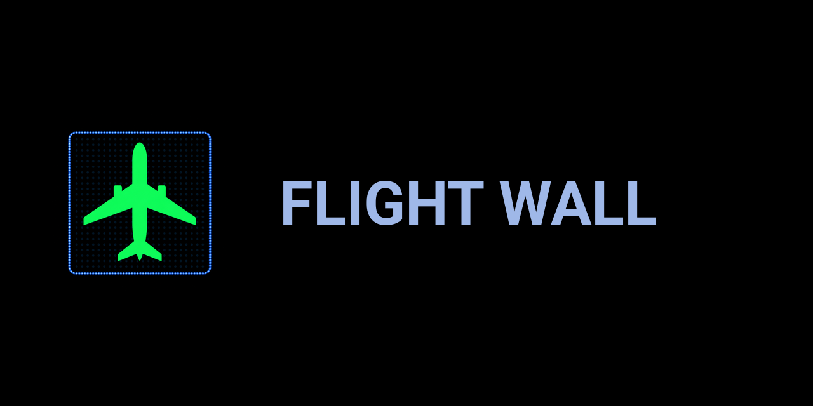
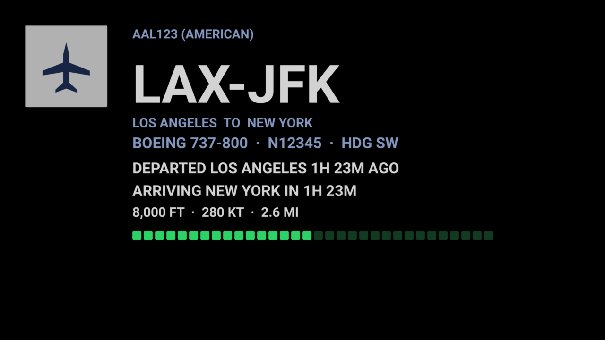
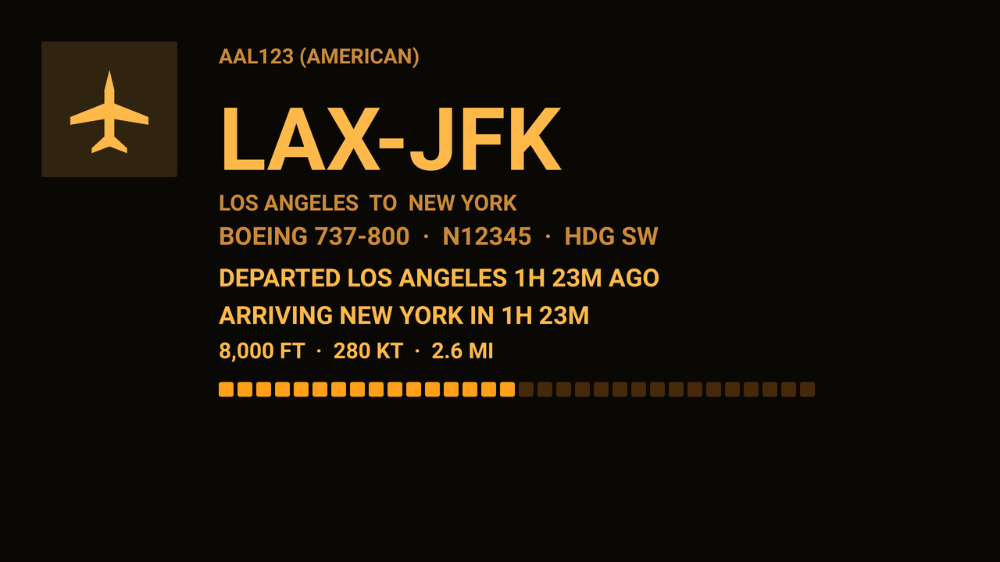
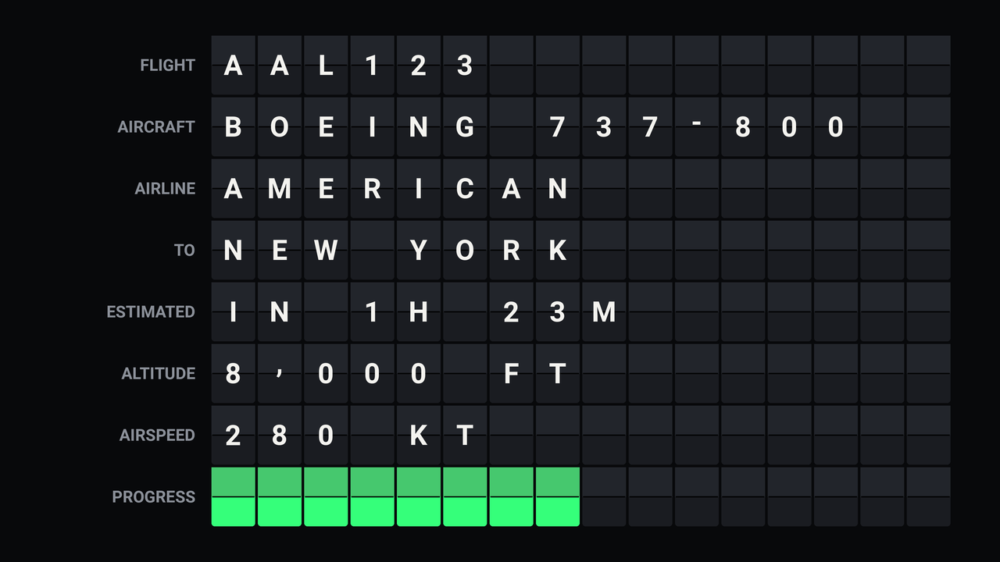
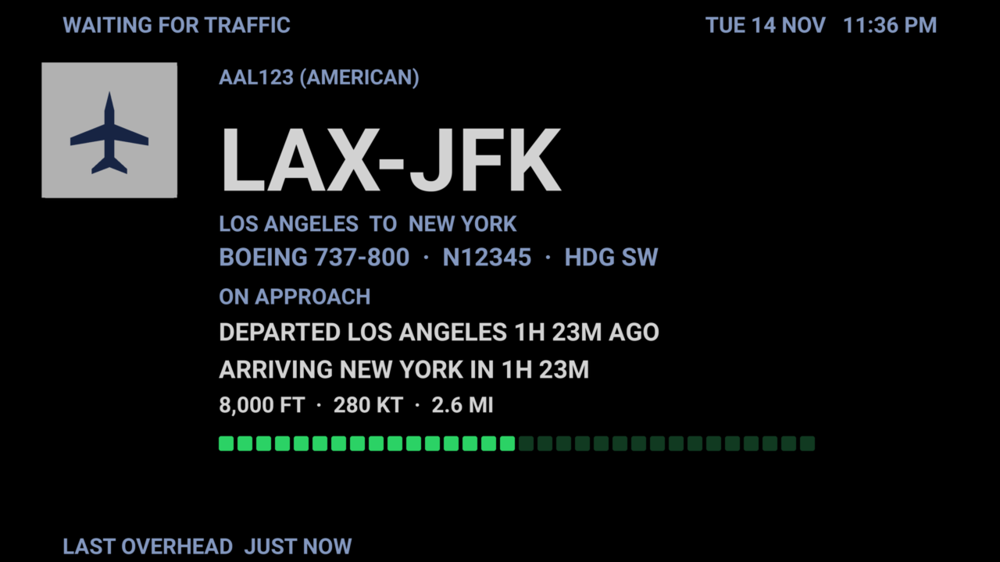
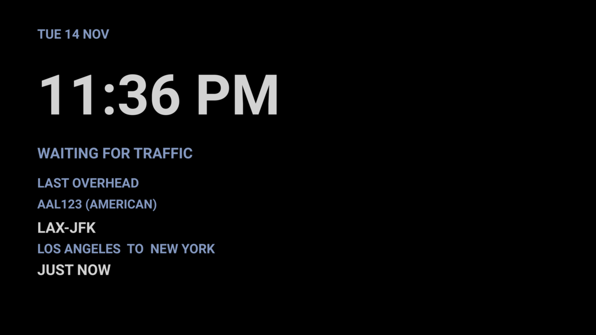

# Flight Wall

A flight display for Home Assistant. When an aircraft passes overhead, a
full-screen board shows the airline, callsign, route, aircraft type,
arrival estimate, live telemetry, and a progress bar.

Use it on a television (Chromecast) or a wall-mounted tablet. Inspired
by physical LED flight boards, in particular
[The Flightwall](https://theflightwall.com/).

## What it does

- Picks the single most visible aircraft in range using **elevation
  angle**, not ground distance. A jet at 38,000 ft ten kilometres away
  is not the plane in the window; the one on approach at 3,000 ft is.
- Shows city names, registration, heading, and a next-up flight when a
  second aircraft is in range. Empty sky shows the last aircraft (or a
  large clock, if you pick that waiting layout). Last overhead and
  today's traffic survive a Home Assistant restart.
- On a TV, writes a 4K board image and Casts it. On a tablet, open the
  Flightwall dashboard (or the animated split-flap page) in a browser
  or Fully Kiosk.

## Themes

The HACS integration has five themes under
**Settings → Devices & Services → Flight Wall → Configure**:

| Theme | Look |
|---|---|
| **LED night** | Black board, blue muted text, green progress, LED grid |
| **Plain large type** | Same colours, no grid — clearest on a large set |
| **Amber departures** | Warm amber type on black |
| **Split-flap** | Mechanical departure board (labels + 16-character flaps). Still image on TV; the tablet HTML page animates |
| **Night dim** | Same layout as LED, much darker — a bedroom wall at night |

Airline marks sit in a logo column. When Flightradar24 has no airline
code, a generic aircraft mark is used so the layout stays the same.
Split-flap has no logo — a real flap board cannot display one.

TV image themes (HACS, Display → Image):

Waiting for traffic (last aircraft, then large-clock layout):

## Requirements

### Television (HACS)

| Component | Source | Why |
|---|---|---|
| [Flightradar24](https://github.com/AlexandrErohin/home-assistant-flightradar24) | HACS | Flight data |
| A `media_player` that reports TV on/off | Core (Vizio, webOS, Android TV, …) | Knows the set is on |
| A Google Cast `media_player` on that set | Core | Receives the board image |

Home Assistant should be reachable over **HTTPS** (Nabu Casa or
`external_url`) so Cast can discover it. The board image is served on
the LAN as `/local/flightwall-board.png`.

Do **not** also install `packages/flightwall.yaml` if you use HACS —
you would get duplicate entities.

### Tablet (same HACS install)

A browser or [Fully Kiosk](https://www.fully-kiosk.com/) on a wall
tablet. Open the **Flightwall** sidebar dashboard. The Plus licence is
only needed if Home Assistant should wake the screen.

### Data source

The Flightradar24 integration uses an undocumented endpoint. It can
break when FR24 changes their API. For something durable, run a local
ADS-B receiver (RTL-SDR plus `readsb`/`tar1090`) and either:

- paste the `aircraft.json` URL in Flight Wall → Configure, or
- point a REST sensor with an `aircraft` attribute at that URL and pick
  that sensor as the flights source.

Local ADS-B has callsign, type, and registration, but not airline
logos or city-pair routes.

## Installation

### HACS (recommended)

1. Install [Flightradar24](https://github.com/AlexandrErohin/home-assistant-flightradar24)
   via HACS. Set coordinates and a **30 km** radius. Rename the
   flights-in-area sensor to `sensor.flightradar24_flights_in_area` if
   you want the default name (the integration names it after your HA
   language).
2. HACS → three dots → **Custom repositories** →
   `https://github.com/gmisner/ha-flightwall` → type **Integration** →
   Add.
3. Find **Flight Wall** in HACS and download it. Restart Home Assistant.
4. **Settings → Devices & Services → Add integration → Flight Wall.**
   Pick the FR24 flights sensor. For a TV, also pick the power
   `media_player` and the Chromecast `media_player` on that set.
5. Leave `switch.flightwall_tv` on. Put it on a dashboard if someone
   will want Netflix or another app in that room. While the switch is
   on, turning the TV on with the remote starts Cast. If they then
   switch to another source, Flight Wall stays out of the way until the
   set is turned off and on, you re-arm the switch, or you call
   `flightwall.recast`. Keepalive only refreshes while Cast is showing
   the board.
6. **Display**, **Theme**, **Units**, clock, altitude, logos, image
   refresh, inbound off-delay, waiting-board layout, quiet hours, and
   an optional local ADS-B URL are under
   **Settings → Devices & Services → Flight Wall → Configure**.

The first instance creates `sensor.flightwall_flight`, the inbound
binary sensor, the TV switch, and a **Flightwall** sidebar dashboard.
A second Add Integration (another TV, or another flights sensor) gets
`sensor.flightwall_flight_2` and its own dashboard. Existing installs
keep their current entity IDs. The board should appear about ten
seconds after the TV is turned on. Home Assistant never powers the set
down.

**Display**

- **Image** — 4K PNG over Cast. Use this on a television whose built-in
  Chromecast cannot load a live Home Assistant dashboard (many 2018–2020
  smart TVs).
- **Live** — Home Assistant Cast of the Flightwall dashboard. Use this
  on a tablet, Fully Kiosk, or a Chromecast with Google TV. If live
  Cast does not connect, Flight Wall falls back to the image.

**Units:** Imperial (ft, kt, mi) or Metric (m, km/h, km). Clock can
follow units or be forced to 12-hour / 24-hour. Minimum altitude,
airline marks, and quiet hours are on the same Configure page.

Full TV notes: [docs/TV.md](docs/TV.md).

### Tablet URL

Do not install the YAML package. Open
`http://YOUR_HA:8123/flight-wall/board` in a browser or Fully Kiosk.
Use Display → Live if you want that dashboard on a Chromecast that can
load Home Assistant.

The integration copies the animated split-flap page to
`/local/flightwall/splitflap.html` on setup. Open that URL for the
mechanical flap animation; the TV PNG is still.

### Legacy YAML package

`packages/flightwall.yaml` and `automations/flightwall_popup.yaml` are
the older browser-mod popup. Use them only if you already have that
stack and do not want the HACS integration. Do not run both.

## Configuration

HACS options live in the integration Configure dialog. See
[docs/CUSTOMISATION.md](docs/CUSTOMISATION.md).

| What | Where | Default |
|---|---|---|
| Display, theme, units, clock, logos, image refresh, inbound off-delay, waiting board, quiet hours, ADS-B | Integration → Configure | Image, LED night, imperial, 20 s refresh, 120 s inbound, last aircraft waiting |
| TV is a flight board | `switch.flightwall_tv` | on after setup |
| How long after the last aircraft | **Inbound off-delay** (inbound binary sensor debounce) | 2 minutes |

## Known limitations

- **Airline logos max out at 128 px** (Kiwi CDN). Roundels work; script
  wordmarks stay hard to read under the LED grid.
- **Missing logos** use a generic aircraft mark so the column does not
  collapse.
- **`aircraft_model` is not always populated.** Known ICAO type codes
  (B738, A320, …) are expanded to a name; unknown codes stay as-is.
- **Airline logos are cached** under `/local/flightwall/logos/{IATA}.png`
  after the first fetch from the Kiwi CDN.
- **The LED grid softens type on purpose.** Use the plain theme on a
  large television if you want maximum sharpness.
- **Many built-in Chromecasts cannot load a live Home Assistant
  dashboard.** Use Display → Image. AirPlay is manual mirroring from an
  Apple device; Home Assistant cannot start it. See
  [docs/TV.md](docs/TV.md).
- **Split-flap values are 16 characters.** Longer airline or aircraft
  names truncate.

## Trademarks and affiliation

This is an independent hobby project. It is not affiliated with,
endorsed by, sponsored by, or connected to The Flightwall,
Flightradar24, Kiwi.com, or any airline.

All product names, logos, and brands are the property of their
respective owners. Airline logos are fetched from a third-party CDN
on first use, cached under `/local/flightwall/logos/`, and shown
solely to identify the aircraft currently overhead.

## Credits

Inspired by [The Flightwall](https://theflightwall.com/). Flight data
via the
[Flightradar24 integration](https://github.com/AlexandrErohin/home-assistant-flightradar24)
by AlexandrErohin. Airline logos from the Kiwi.com CDN. Tablet typeface
is [Press Start 2P](https://fonts.google.com/specimen/Press+Start+2P)
by CodeMan38. TV board typeface is
[Roboto](https://fonts.google.com/specimen/Roboto).

## Licence

MIT. See [LICENSE](LICENSE).
